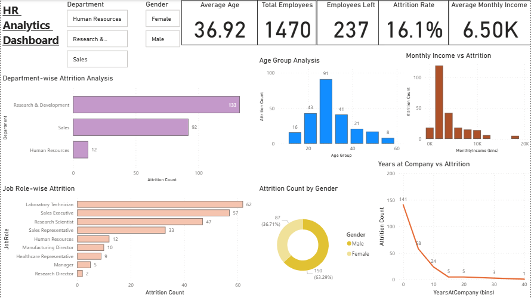

# HR Analytics Dashboard

## Project Overview
Built an HR Analytics Dashboard in Power BI to analyze employee attrition patterns and workforce demographics.

## Key Insights
- Analyzed employee attrition across Departments and Job Roles.
- Examined attrition trends by Gender and Age Groups.
- Investigated the relationship between Monthly Income and employee turnover.
- Studied attrition patterns based on employee tenure (Years at Company).
- Built interactive filters to enable dynamic workforce analysis.

## KPI Metrics
- Total Employees
- Employees Left
- Attrition Rate
- Average Monthly Income
- Average Age

## Tools Used
- Power BI
- DAX
- Excel / CSV Dataset

## Dashboard Preview

